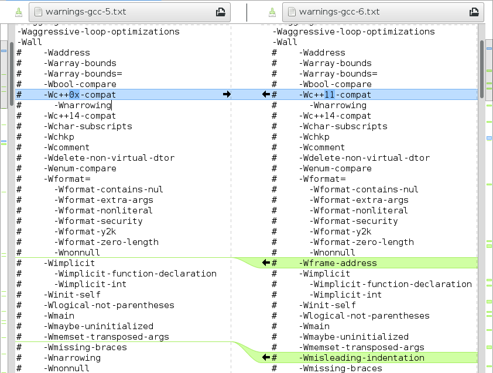

# C/C++/Objective-C compiler warning flags collection and parsers

This project includes tools and lists to figure out the warning flags
that [the clang compiler](http://clang.llvm.org/), the
[GNU Compiler Collection](https://gcc.gnu.org/), and
[Apple's LLVM fork (used in Xcode)](https://github.com/apple/llvm-project)
have for C family languages (C, C++, and Objective-C). This also shows all
aliases and warning flags that a certain flag enables (prefixed with "#"
character) so that you can easily see which flag is enabled by
what. There are also warning flags that do nothing for compatibility
or deprecation reasons. They are suffixed with "# IGNORED switch" text.

The purpose of these collections is to make it more easy to use the
static code analysis tools that compilers provide.

## The Lists

* [clang](clang/README.md)
* [gcc](gcc/README.md)
* [Apple clang (Xcode)](xcode/README.md)

## Examining differences

One use case for these kinds of lists is to see what differences there
are between different compilers and compiler versions. I have made
available rudimentary compiler flag differences between two consequent
compiler versions as diff-files, but for more specific differences you
need to use some (visual) diff program, as shown below:

# Development

## Overview

This uses [ANTLR](http://www.antlr.org/) as a parser generator with
some supporting Python code to parse warning flags from actual
compiler option data files. Other requirements are following (plus
their dependencies):

* [Ninja](https://ninja-build.org/)
* [ANTLR4](http://www.antlr.org/)
* [Python 3.10+](https://www.python.org/)
* [antlr4-python3-runtime](https://pypi.python.org/pypi/antlr4-python3-runtime/)
* llvm-tblgen from [LLVM 7 or newer](https://llvm.org/)

## Building (the easy way)

A top-level script, `make.sh`, is provided. The `make.sh` script takes
care of setting up a Docker image with all of the above dependencies,
creates/updates local clones of the gcc and clang source repositories,
builds the parsers, and generates the lists.

The only prerequisite for `make.sh` is a recent version of [Docker](https://www.docker.com).

## Building gcc warning lists (by hand)

After you have installed all the requirements and are able to run
ANTLR with `antlr4` command, just use following commands in `parsers/`
directory to generate the gcc lists yourself:

    ninja
    ./parse-gcc-warning-options.py <path-to-gcc-source>/gcc/{common.opt,c-family/c.opt}

## Building clang warning lists (by hand)

After you have installed all the requirements and are able to run
`llvm-tblgen`, just use following commands in `parsers/` directory to
generate the clang lists yourself:

    llvm-tblgen -dump-json -I<path-to-clang-source>/include/clang/Basic \
      include/clang/Basic/Diagnostic.td > ../clang/warnings-$VERSION.json
    ./parse-clang-diagnostic-groups.py ../clang/warnings-$VERSION.json

And you'll get the list of all individual warning flags and their
dependencies that are in the requested compiler version.

To generate filtered lists, you may use `--top-level` and `--unique`
switches.

* `--top-level` switch does not include warnings that are enabled by
  some other switch in the list.
* `--unique` lists all warnings without any information what other
  warnings they enable. Diffs on this page are created from these
  files.

## Tests

There are some unit tests testing the low level functionality. You may
run time with `ninja test` command in `parsers/` directory to verify
that unit tests pass.

## Processing git repositories

When parser gets a change that affects formatting or other output for
multiple files these warning lists need to be recreated. There are
`process_clang_git.py` and `process_gcc_git.py` scripts that take the
git repository root as their first parameter and apply all different
variants of these commands to create final text files.
